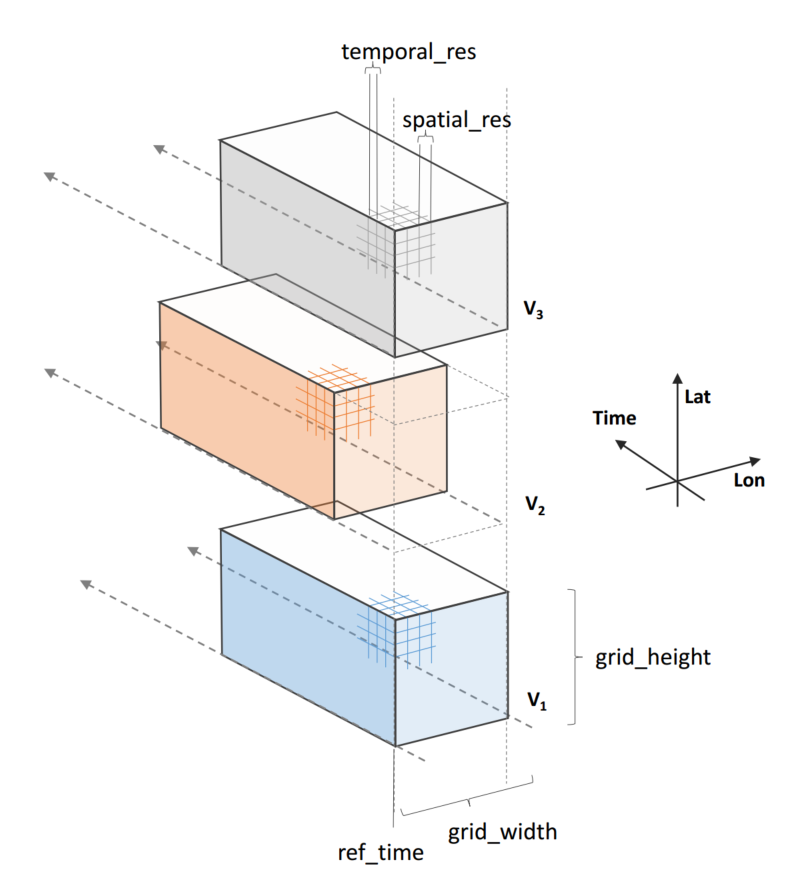
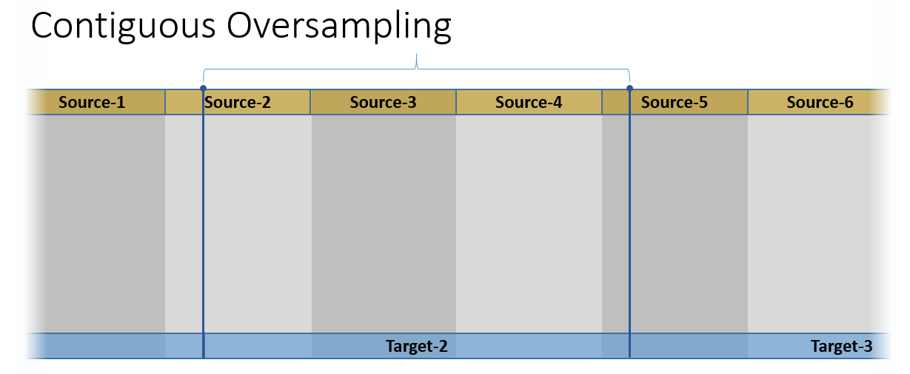
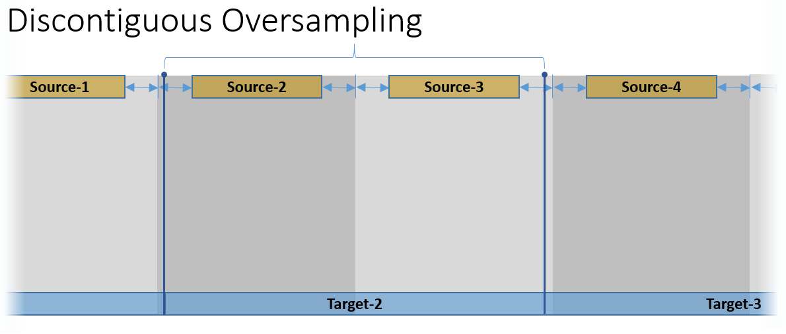
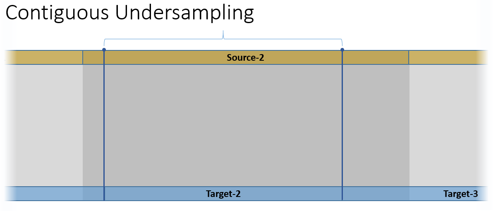
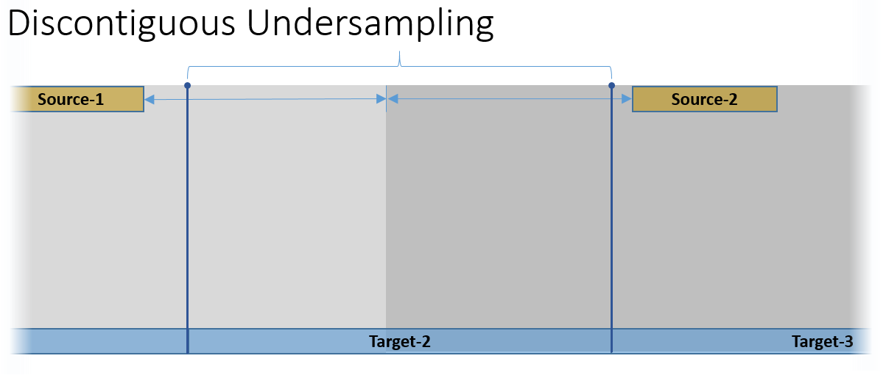

=========================================
How can I use the Earth System Data Cube?
=========================================

Technical Dataset Description
=============================

.. Responsible: BC

General Data Cube Format, Content and Organisation
--------------------------------------------------

The binary data format for the Earth System Data Cube (ESDC) in the CAB-LAB project is **netCDF 4 classic**, where the term classic stands for an
underlying HDF-5 format accessed by a netCDF 4 API.

The netCDF file's content and structure follows the `CF-conventions <http://cfconventions.org/cf-conventions/v1.6.0/cf-conventions.html>`_.
That is, there are are always at least three dimensions defined

1. ``lon`` - Always the inner and therefore fastest varying dimension. Defines the **raster width** of spatial images.
2. ``lat`` - Always the second dimension. Defines the **raster height** of spatial images.
3. ``time`` - Time dimension.

There are 1D-variables related to each dimension providing its actual values:

* ``lon(lon)`` and ``lat(lon)`` - longitudes and latitudes in *decimal degrees* defined in a WGS-84 geographical
    coordinate reference system. The spatial grid is homogeneous with the distance between two grid points referred to as
    the ESDC's **spatial resolution**.
* ``start_time(time)`` and ``end_time(time)`` - Period start and end times of a datum given in
    *days since 2001-01-01 00:00*. The increments between two values in time are identical and referred to as the
    ESDC's **temporal resolution**.

There is usually only a single geophysical variable with *shape*\ (``time``, ``lat``, ``lon``) represented by each
netCDF file. So each netCDF file is composed of *length*\ (``time``) spatial images of that variable, where each image
of size *length*\ (``lon``) x *length*\ (``lat``) pixels has been generated by aggregating all source data contributing
to the period given by the ESDC's temporal resolution.

To limit the size of individual files, the geophysical variables are stored in one file per year. For example,
if the temporal resolution is 0.25 degrees and the the spatial resolution is an 8-day period then there will be up to 46
images of 1440 x 720 pixels in each annual netCDF file. These annual files are stored in dedicated sub-directories
as follows::

    <cube-root-dir>/
        cube.config
        data/
            LAI/
                2001_LAI.nc
                2002_LAI.nc
                ...
                2011_LAI.nc
            Ozone/
                2001_Ozone.nc
                2002_Ozone.nc
                ...
                2011_Ozone.nc
            ...

The names of the geophysical variable in a netCDF file must match the name of the corresponding sub-directory and the
file name.

The text file ``cube.config`` contains a Data Cube's static configuration such as its temporal and spatial resolution.
Also the spatial coverage is constant, that is, all spatial images are of the same size. Where actual data is missing,
fill values are inserted to expand a data set to the dimensions of the Data Cube.
The fill values in the Data Cube are identical to the ones used in the Data Cube's sources. The same holds for the data types.
While all images for all time periods have the same size, the temporal coverage for a given variable may vary.
Missing spatial images for a given time period are treated as images with all pixels set to a fill value.

The following table contains all possible configuration parameters:

====================  ==============================  ==========================================================
Parameter             Default Value                   Description
====================  ==============================  ==========================================================
``temporal_res``      ``8``                           The constant temporal resolution given as integer days.
``calendar``          ``'gregorian'``                 Defines the Data Cube's time units.
``ref_time``          ``datetime(2001, 1, 1)``        The Data Cube's time unit is days since a reference date/time.
``start_time``        ``datetime(2001, 1, 1)``        The start date/time of contributing source data.
``end_time``          ``datetime(2011, 1, 1)``        The end date/time of contributing source data.
``spatial_res``       ``0.25``                        The constant spatial resolution given in decimal degrees.
``grid_x0``           ``0``                           The spatial grid's X-offset.
``grid_y0``           ``0``                           The spatial grid's Y-offset.
``grid_width``        ``1440``                        The spatial grid's width. Must always be 360 / ``spatial_res``.
``grid_height``       ``720``                         The spatial grid's height. Must always be 180 / ``spatial_res``.
``variables``         ``None``                        The variables contained in the Data Cube.
``file_format``       ``'NETCDF4_CLASSIC'``           The target binary file format.
``compression``       ``False``                       Whether or not the target binary files should be compressed.
``model_version``     ``'0.1'``                       The version of the Data Cube model and configuration.
====================  ==============================  ==========================================================

General Processing Methods Description
--------------------------------------

The Data Cube is generated by the ``cube-cli`` tool. This tools creates a Data Cube for a given configuration
and can be used to subsequently add variables, one by one, to the Data Cube. Each variable is read from its specific data source and
transformed in time and space to comply to the specification defined by the target Data Cube's configuration.

The general approach is as follows: For each variable and a given Data Cube time period:
* Read the variable's data from all contributing sources that have an overlap with the target period;
* Perform temporal aggregation of all contributing spatial images in the original spatial resolution;
* Perform spatial upsampling or downsampling of the image aggregated in time;
* Mask the resulting upsampled/downsampled image by the common land-sea mask;
* Insert the final image for the variable and target time period into the Data Cube.

.. todo:: Fabian: provide scientific justification here for this approach.*

The following sections describe each method used in more detail.

Gap-Filling Approach
####################

The current version (version 0.1, Feb 2016) of the ESDC does not explicitly fill gaps. However, some
gap-filling occurs during temporal aggregation as described below. The CAB-LAB team may provide
gap-filled ESDC versions at a later point in time of the project. Gap-filling is part of the *Data Analytics
Toolkit* and is thus not tackled during Data Cube generation to retain the information on the original data coverage
as much as possible.

For future Data Cube versions per-variable gap-filling strategies may be applied. Also, only a spatio-temporal
region of interest may be gap-filled while cells outside this region may be filled by global default values. An instructive example
of such an approach would be the gap-filling of a leaf area index (LAI) data set, which only takes place in mid-latitudes while gaps in high-latitudess are
filled with zeros.

.. todo:: Whoever wrote the above should at least reveal the full name of LAI and give a simple explanation why such a gap-filling may make sense at all.
    Moreover, filling gaps with zeros is in fact gap-filling.

Temporal Resampling
###################

Temporal resampling starts on the 1st January of every year so that all the *i*-th spatial images in the ESDC
refer to the same time of the year, namely starting *i* x *temporal resolution*. Source data is collected for every
resulting ESDC target period. If there is more than one contribution in time, then each contribution is weighted
according to the temporal overlap with the target period. Finally, target pixel values are computed by averaging
all weighted values in time not masked by a fill value. By doing so, some temporal gaps are filled implicitly.

Spatial Resampling
##################

Spatial resampling occurs after temporal resampling only if the ESDC's spatial
resolution differs from the data source resolution.

If the ESDC's spatial resolution is higher than the data source's spatial resolution, source images are upsampled
by rescaling hereby duplicating original values, but not performing any spatial interpolation.

If the ESDC's spatial resolution is lower than the data source's spatial resolution, source images are downsampled
by aggregation hereby performing a weighted spatial averaging taking into account missing values. If there is not an
integer factor between the source and the Data Cube resolution, weights will be found according to the spatial overlap of source
and target cells.

+-----+-----+
||im1|||im3||
+-----+-----+
||im2|||im4||
+-----+-----+

Land-Water Masking
##################

After spatial resampling, a land-water mask is applied to individual variables depending on whether
a variable is defined for water surfaces only, land surfaces only, or both. A common land-water mask is used for all
variables for a given spatial resolution. Masked values are indicated by fill values.

Constraints and Limitations
---------------------------

The ESDC approach of transforming all variables onto a common grid greatly facilitates handling and joint analysis
of data sets that originally had different characteristics and were generated under different assumptions.
Regridding, gap-filling, and averaging, however, may alter the information contained in the original data considerably.

The main idea of the ESDC is to provide a consistent and synoptic characterisation of the Earth System at given time steps to promote global analyses.
Therefore, conducting small-scale, high frequency studies that are potentially highly sensible to individual artifacts introduced by data transformation is not
encouraged. The cautious expert user may hence carefully check phenomena close to the Land-Sea mask or in data sparse
regions of the original data. If in doubt, suspicious patterns in the ESDC or unexpected analytical results should be verified with the source data in the native resolution.
We try here as much as possible to conserve the characteristics of the original data, while facilitating data handling and analysis by transformation.

This is a difficult balance to strike that at times involves inconvenient trade-offs. We thus embrace transparency and reproducibility to enable the
informed user to evaluate the validity and consistency of the processed data and strive to offer options for data transformation wherever possible.

.. todo:: Elaborate further! Or at least revise if you feel like it.

Dataset Usage
=============

There are several ways to interact with the ESDC and depending your expertise, resources and, requirements the preferred
method will vary. The CABLAB team is eager to learn more about user needs to continuously improve the capabilities of the
ESDC.

Dataset Access Service
----------------------

The ESDC physically consists of a set of netcdf files on disk, which can be accessed in four different ways:

    * Download from CABLAB's ftp server `<ftp:ftp.brockmann-consult.de>`_. Please contact us to get a valid username.
    * Convenient access via a THREDDS Server at `<http://www.brockmann-consult.de/cablab-thredds/catalog.html>`_.
      The Server allows for subsetting of variables and visual exploration of the data, which can be downloaded as netcdf of
      plain text.
    * Accessing a remotely stored ESDC using the OpenDAP protocol via the Data Access API, which is described in detail below.
      Similar to the options described above, the data will be downloaded to your computer upon request, but depending
      on the variables, and the region and time period of interest, the transferred data volume might be much lower than a
      complete download of the ESDC.
    * Accessing the E-laboratory on a remote Jupyter server, e.g.
      `<http://cablab.earthsystemdatacube.net/cablab-jupyterhub/>`_ (Contact us for login details!). In this case, the data remains in the remote server and also the user's
      computations are executed remotely. This is the most resource efficient and convenient way of exploring the ESDC.

In addition, a cube.config file containing essential metadata of the ESDC is requires to use to Data Access API. It is automatically
generated during the generation of the ESDC and available on the ftp server and the CABLAB homepage.

Getting started
---------------

While in principle the netcdf files comprising the ESDC can be used with any tool of choice, we developed specifically tailored Data Access APIs
for Python 3.X and Julia. In the future, Matlab and Java will join the two to cover the most common programming languages in Earth System Sciences.
Furthermore, a set of high-level routines for data analysis, the Data Analytics Toolkit, greatly facilitates
standard operations on the large amount of data in the ESDC. While in the E-laboratory, the Data Access API and the DAT are already pre-installed,
the user has to download and install the cube library when working on a local computer.

To get started on your local computer, clone the cablab-core repository from `<https://github.com/CAB-LAB>`_:

.. code-block:: tcsh

    git clone https://github.com/CAB-LAB/cablab-core

It will create a new folder cablab-core, which contains a file named setup.py. Before installation, the system dependencies should be checked.
Currently, the cablab-core library requires the following python packages:

    * netCDF4 >= 1.2
    * numpy >= 1.9
    * scikit_image >= 0.11
    * scipy >= 0.16
    * matplotlib >= 1.4

If your python installation lacks one or all of the above packages, we recommend to visit `<http://www.lfd.uci.edu/~gohlke/pythonlibs/>`_ to obtain pre-compiled Python binaries for different
architectures, which can be then installed using pip:

.. code-block:: tcsh

    pip install <wheel-file>

Kudos to Christoph Gohlke for the continuous efforts!
The cablab-core library can be installed from terminal (Linux/Unix/MacOs) or shell (Windows):

.. code-block:: tcsh

    python setup.py install

After download of a ESDC including the corresponding cube.config file and successful installation of the ESDC,
you are ready to explore the data in the ESDC!

Data Access with the API
------------------------

In the following, the Data Access via a Python notebook in Jupyter is described. All commands do, however, also work in any
interactive Python environment or in a Python script. `Jupyter <http://jupyter.org/>`_ is already included in several Python
distributions, but can also be installed by a simple

.. code-block:: tcsh

    pip install jupyter

and started from the command line by typing:

.. code-block:: tcsh

    jupyter notebook

This will open an interactive jupyter session in your browser. In the example below, it
is demonstrated how the user can access a locally stored ESDC, query the content, and get chunks of different sizes for further
analysis. A valid configuration file, typically named cube.config, has to be located in the root folder of the ESDC, i.e. in the folder
you pass to Cube.open(). It contains essential metadata about the ESDC to be loaded and is automatically built during the generation of the ESDC. Some more elaborate demonstrations are also included in the
`cablab-shared repository on git-hub <https://github.com/CAB-LAB/cablab-shared/tree/master/notebooks>`_ and the `API reference <api_reference.html>`_
is located in the Annex of this Product Handbook.

Data Access example
-------------------

In this notebook, data access using CABLAB's Python API is demonstrated.

.. code:: python

    from cablab import Cube
    from cablab import CubeData
    from datetime import datetime
    import numpy as np

.. code:: python

    cube = Cube.open("/path/to/datacube")
    cube_reader = CubeData(cube)

.. code:: python

    cube_reader.variable_names

.. parsed-literal::

    {'BurntArea': 0,
     'Emission': 1,
     'Ozone': 2,
     'Precip': 3,
     'SoilMoisture': 4,
     'tcwv_res': 5}

After successful opening the ESDC, chunks of data or the entire data set can be accessed via the get() function. Below we demonstrate basic approaches
to retrieve different kind of subsets of the ESDC using the Data Access API in Python. The corresponding API for Julia is
very similar and illustrated in the `Data Analytics Toolkit <dat_usage.html>`_ section.

**Get the cube's data**

The get() method expects up to four arguments:

.. parsed-literal::
    get(variable=None, time=None, latitude=None, longitude=None)

with

*variable:* a variable index or name or an iterable returning multiple
of these (var1, var2, ...

*time:* a single datetime.datetime object or a 2-element iterable
(time\_start, time\_end)

*latitude:* a single latitude value or a 2-element iterable
(latitude\_start, latitude\_end)

*longitude:* a single longitude value or a 2-element iterable
(longitude\_start, longitude\_end)

*return:* a dictionary mapping variable names --> data arrays of
dimension (time, latitude, longitude)

**Getting a chunk of 1 variable, all available time steps, and 40 x 40 spatial grid points:**

.. code:: python

    precip_chunk = cube_reader.get('Precip',None,(0,10),(0,10))
    np.array(precip_chunk).shape

.. parsed-literal::

    (1, 457, 40, 40)

**Getting time-series at a single point of all variables for the entire period:**

.. code:: python

    time_series = cube_reader.get(None,None,51.34,8.23)
    [var.shape for var in time_series]

.. parsed-literal::

    [(457,), (457,), (457,), (457,), (457,), (368,)]

**Getting a complete global image of a variable at a specific time**

.. code:: python

    Emission_single_image = cube_reader.get('Emission', datetime(2002,1,1))
    np.array(Emission_single_image).shape

.. parsed-literal::

    (1, 720, 1440)

.. code:: python

    cube.close()

Note that the available memory limits the maximum size of the data chunk that can be simultaneously loaded, e.g. a simple cube_reader.get()
will load the entire ESDC into memory and thus likely fail on most personal computers.

