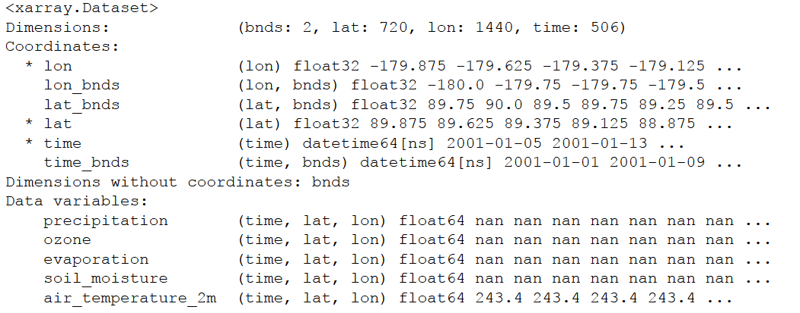
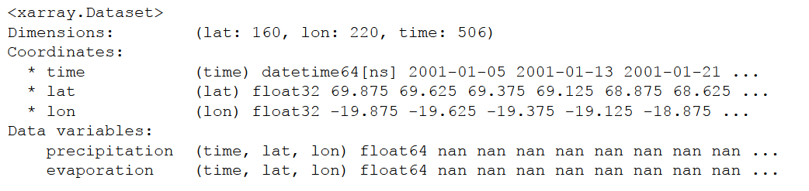
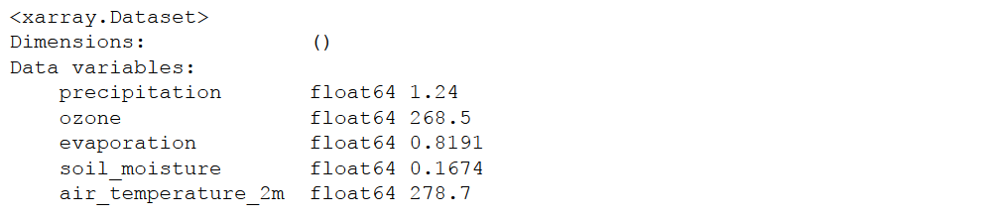
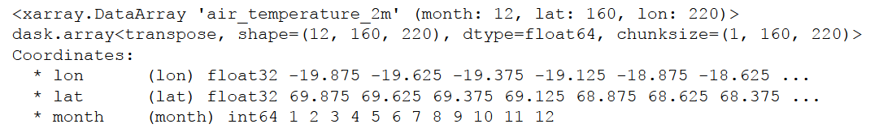
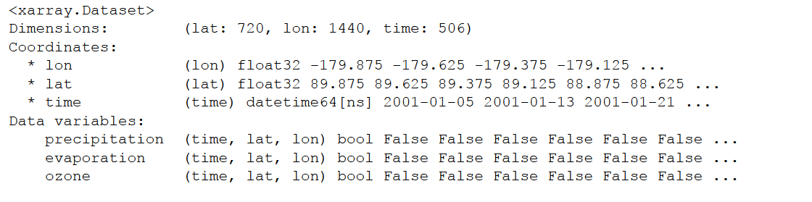
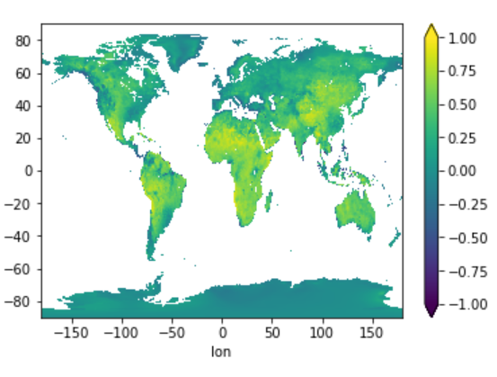
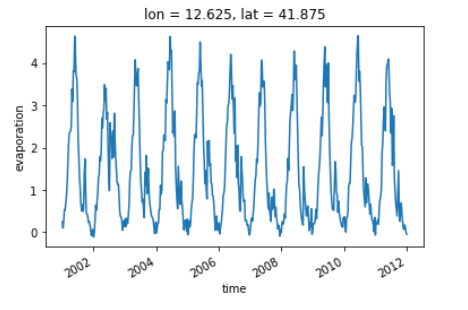
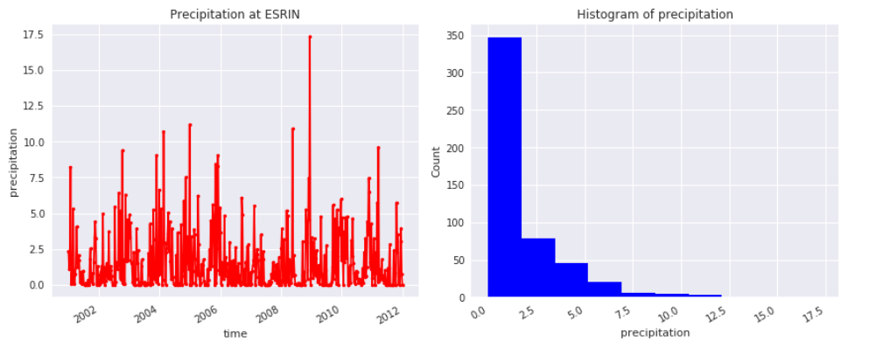
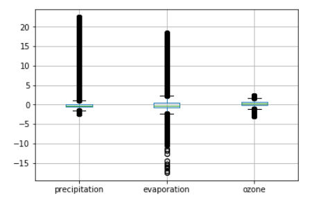

.. _xarray: http://xarray.pydata.org/en/stable/
.. _xarray.Dataset: http://xarray.pydata.org/en/stable/data-structures.html#dataset
.. _xarray.DataArray: http://xarray.pydata.org/en/stable/data-structures.html#dataarray
.. _xarray API: http://xarray.pydata.org/en/stable/api.html
.. _xarray Indexing and selecting data: http://xarray.pydata.org/en/stable/indexing.html
.. _Numpy: http://www.numpy.org/
.. _dask: http://dask.pydata.org/en/latest/
.. _pandas: http://pandas.pydata.org/
.. _datetime: https://docs.python.org/3/library/datetime.html
.. _Numpy ndarrays: http://docs.scipy.org/doc/numpy/reference/arrays.ndarray.html
.. _cablab.dat: https://github.com/CAB-LAB/cablab-core/blob/master/cablab/dat.py
.. _E-Lab: https://cablab.earthsystemdatacube.net
.. _Jupyter notebook: https://github.com/CAB-LAB/cablab-shared/blob/master/notebooks/Python/Python_DAT.ipynb

.. _Indexing and selecting data: http://xarray.pydata.org/en/stable/indexing.html
.. _Computation: http://xarray.pydata.org/en/stable/computation.html
.. _Split-apply-combine: http://xarray.pydata.org/en/stable/groupby.html
.. _Reshaping and reorganizing data: http://xarray.pydata.org/en/stable/reshaping.html
.. _Combining data: http://xarray.pydata.org/en/stable/combining.html
.. _Time series data: http://xarray.pydata.org/en/stable/time-series.html

.. highlight:: rst

.. role:: python(code)

==============
DAT for Python
==============

Overview
========

The main objective of the Data Analytics Toolkit is to facilitate the exploitation
of the multi-variate data set in the ESDC for experienced users and empower less experienced
users to explore the wealth of information contained in the ESDC. To this end, Python is almost
a natural choice for the programming language, as it is easy to learn and use, offers numerous,
well-maintained community packages for data handling and analysis, statistics, and visualisation.

The DAT for Python relies primarily on xarray_ a package that provides N-dimensional data structures
and efficient computing methods on those object. In fact, xarray closely follows the approach adopted
NetCDF, the quasi-standard file format for geophysical data, and provides methods for many
commonly executed operations on spatial data.
The central data structure used for representing the ESDC in Python is thus the `xarray.Dataset`_.

Such dataset objects are what you get when accessing the cube's data as follows:

.. code-block:: python

    from cablab import Cube
    cube = Cube.open("/home/doe/esdc/cablab-datacube-0.2.4/low-res")
    dataset = cube.data.dataset(["precipitation", "evaporation", "ozone", "soil_moisture","air_temperature_2m"])

Any geo-physical variable in the ESDC is represented by a `xarray.DataArray`_, which are Numpy_-like data arrays
with additional coordinate information and metadata.

The following links point into the xarray_ documentation, they provide the low-level interface for the Python DAT:

* `Indexing and selecting data`_
* `Computation`_
* `Split-apply-combine`_
* `Reshaping and reorganizing data`_
* `Combining data`_
* `Time series data`_

Building on top of the xarray_ API the DAT offers high-level functions for ESDC-specific workflows
in the `cablab.dat`_ module. These functions are addressing specific user requirements and
the scope of the module will increase with the users of the DAT. In the following, typical use cases and examples
provide an illustrative introduction into the usage of the DAT and thus into the exploration of the ESDC.

Use Cases and Examples
======================
The below examples are all contained in a `Jupyter notebook`_, which is also available in the E-Lab_.

Data Access and Indexing
------------------------

In the first step described above, a subset of five variables is loaded into the DataSet, which distinguishes
between Dimensions, Coordinated, and Data Variables, just like NetCDF.

.. code-block:: python

    dataset

Addressing a single variable returns a xarray DataArray and reveals the metadata associated to the variable. Note the
similarity to the Pandas syntax here.

.. code-block:: python

    dataset.precipitation

.. image:: pix/dat2.png
    :scale: 100%
    :align: left

The actual data in a variable can be retrieved by calling  :python:`dataset.precipitation.values`, which returns a
numpy array.

.. code-block:: python

    isinstance (dataset.precipitation.values,np.ndarray)

xarray offers different ways for indexing, both integer and label-based look-ups, and the reader is referred to the
exhaustive section in the respective section of the xarray documentation: `xarray Indexing and selecting data`_.
The following example, in which a chunk is cut out from the larger data set, demonstrates the convenience of xarrays
syntax. The result is again a xarray DataArray, but with only subset of variables and restricted to a smaller domain in
latitude and longitude.

.. code-block:: python

    dataset[['precipitation', 'evaporation']].sel(lat = slice(70.,30.), lon = slice(-20.,35.))

Computation
-----------
It was a major objective of the Python DAT to facilitate processing and analysis of big, multivariate geophysical
data sets like the ESDC. Typical use cases include the execution of functions on all data in the ESDC, the aggregation
of data along a common axis, or analysing the relation between different variables in the data set. The following
examples shed a light on the capabilities of the DAT, more typical examples can be found in the `Jupyter notebook`_ and
the documentation of xarray_ provides an exhaustive reference to the package's functionalities.

Many generic mathematical functions are implemented for DataSets and DataArrays. For example, an average over all
variables in the dataset can thus be easily calculated.

.. code-block:: python

    dataset.mean(skipna=True)

Note that calculating a simple average on a big data set
may require more resources, particularly memory, than is available on the machine you are working at. In such cases,
xarray automatically involves a package called dask_ for out-of-core computations and automatic parallelisation. Make
sure that dask is installed to significantly improve the user experience with the DAT. Similar to pandas_, several
computation methods like :python:`groupby` or :python:`apply` have been implemented for DataSets and DataArrays. In
combination with the datetime_ data types, a monthly mean of a variable can be calculated as follows:

.. code-block:: python

    dataset.air_temperature_2m.groupby('time.month').mean(dim='time')

In the resulting DataArray, a new dimension :python:`month` has been automatically introduced.
Users may also define their own functions and apply them to the data. In the below example, zcores are computed for
the entire DataSet by usig the built-in functions :python:`mean` and :python:`std`. The user function
:python:`above_Nsigma` is applied to all data to test if a zscore is above or below two sigma, i.e. is an outlier. The
result is again a DataSet with boolean variables.

.. code-block:: python

    def above_Nsigma(x,Nsigma):
        return xr.ufuncs.fabs(x)>Nsigma

    zscores = (dataset-dataset.mean(dim='time'))/dataset.std(dim='time')
    res = zscores.apply(above_Nsigma,Nsigma = 2)
    res

In addition to the functions and methods xarray is providing, we have begun to develop high-level functions that
simplify typical operations on the ESDC. The function :python:`corrcf` computes the correlation coefficient between
two variables.

Plotting
--------
Plotting is key for the explorative analysis of data and for the presentation of results. This is of course even more
so for Earth System Data. Python offers many powerful approaches to meet the diverse visualisation needs of different
use cases. Most of them can be used with the ESDC since the data can be easily transferred to numpy arrays or pandas
data frames. The following examples may provide a good starting point for developing more specific plots.

Calculating the correlation coefficient of two variables and plot the resulting 2D image af latitude and longitude.

.. code-block:: python

    cv = DAT_corr(dataset, 'precipitation', 'evaporation')
    cv.plot.imshow(vmin = -1., vmax = 1.)

Plotting monthly air temperature in twelve subplots.

.. code-block:: python

    Air_temp_monthly = dataset.air_temperature_2m.groupby('time.month').mean(dim='time')
    Air_temp_monthly.plot.imshow(x='lon',y='lat',col='month',col_wrap=3)

.. image:: pix/dat9.png
   :scale: 100%
   :align: center

A simple time-series plot at a given location.

.. code-block:: python

    dataset.evaporation.sel(lon = 12.67,lat = 41.83, method = 'nearest').plot()

Plotting a projected map using the DAT function :python:`map_plot`.
.. code-block:: python

    fig, ax, m = map_plot(dataset,'evaporation','2006-03-01',vmax = 6.)

.. image:: pix/dat11.png
   :scale: 75%
   :align: center

Generating a subplot of a time-series at a given location and the associated histogram of the data.

.. code-block:: python

    precip1d = dataset['precipitation'].sel(lon = 12.67,lat = 41.83, method = 'nearest')
    fig, ax = plt.subplots(figsize = [12,5], ncols=2)
    precip1d.plot(ax = ax[0], color ='red', marker ='.')
    ax[0].set_title("Precipitation at ESRIN")
    precip1d.plot.hist(ax = ax[1], color ='blue')
    ax[1].set_xlabel("precipitation")
    plt.tight_layout()

Convert a DataSet into an pandas dataframe and generate a boxplot from the dataset.

.. code-block:: python

   zscore = (dataset-dataset.mean(dim='time'))/dataset.std(dim='time')
   df = zscore.to_dataframe()
   df.boxplot(column=["precipitation","evaporation","ozone"])

Python API Reference
====================

The low-level interface of the ESDC Python DAT is the `xarray API`_.

The following functions provide the high-level API of the ESDC Python DAT:

.. automodule:: cablab.dat
    :members:

