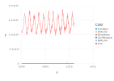
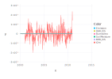
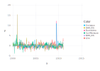
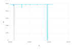

User Story 1: Calculating recurrence scores in time-series
----------------------------------------------------------

.. code:: julia

    using CABLAB
    using ImageMagick #Necessary for inline Map plots

To start, we define the path to the ESDC, choose some variables, and read a
geographical region into memory.

.. code:: Julia

    c             = Cube("/path/to/datacube/")
    vars          = ["BHR_VIS","BurntArea","DHR_VIS","Emission","SoilMoisture","t2m"];
    cdata         = getCubeData(c,latitude=(35,45), longitude=(-10,0),variable=vars);
    cdata         = joinVars(cdata);

Here starts the actual processing step. Note that each function call has
the result of the previous call as its input argument. The following
processing steps are applied:

-  gap-filling with information from the mean seasonal cycle
-  calculating anomalies, i.e. subtract the mean seasonal cycle
-  normalize the different variables to unit variance
-  calculate recurrence scores to detect outliers

.. code:: julia

    cube_filled     = gapFillMSC(cdata,46);
    cube_anomalies  = removeMSC!(cube_filled,46);
    cube_normalized = normalize(cube_anomalies);
    scores          = recurrences!(cube_normalized,500.0,5,zeros(Float32,506,506));

The results can be visualized by interactive time-series plots of the different
variables, anomalies, and recurrence scores. In this example, three extreme events are detected.

.. code:: julia

    plotTS(cube_filled)

.. raw:: html

    

.. code:: julia

    plotTS(cube_anomalies)

.. raw:: html

    

.. code:: julia

    plotTS(cube_normalized)

.. raw:: html

    

.. code:: julia

    scores          = recurrences!(cube_normalized,7.0,5,zeros(Float32,506,506));
    plotTS(scores)

.. raw:: html

    

