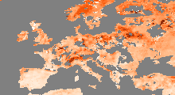
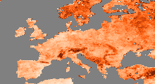
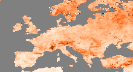

User Story 2: Calculating temporal variance with and without seasonal cycle
---------------------------------------------------------------------------

.. code:: julia

    using CABLAB
    using ImageMagick

A Cube object is defined by its path. Data can be read into memory using the getCubeData function.

.. code:: julia

    c             = Cube("/path/to/datacube/")
    cdata         = getCubeData(c,variable="SoilMoisture",latitude=(35,65), longitude=(-15,40));

Here we demonstrate how to add a user-defined function that capitalizes on the DAT's
capabilities. First, a function with the signature *xin*
(input data), *xout* (output data), *maskin* (input mask), *maskout*
(output mask) is defined. In this simple case, the sample function *varianceTime* calculates the variance of a time
series. Then @registerDATFunction macro is called, which creates a
wrapper around the function and makes it applicable to a Cube object.

.. code:: julia

    function varianceTime{T}(xin::AbstractVector{T},xout::AbstractArray{T,0},maskin::AbstractVector,maskout::AbstractArray{UInt8,0})
      s=zero(T)
      s2=zero(T)*zero(T)
      n=0
      for i in eachindex(xin)
        if maskin[i]==CABLAB.VALID
          s+=xin[i]
          s2+=xin[i]*xin[i]
          n+=1
        end
      end
      if n>0
        m=s/n
        v=s2/n-m*m
        xout[1]=v
        maskout[1]=CABLAB.VALID
      else
        maskout[1]=CABLAB.MISSING
      end
    end

    @registerDATFunction varianceTime (TimeAxis,) ();

The function can be called with the three-dimensional Cube object as its argument and returns the time variance
for each of the grid points defined by the two spatial dimensions of the ESDC.

.. code:: julia

    v1             = varianceTime(cdata);
    cube_anomalies = removeMSC!(cdata,46);
    v2             = varianceTime(cube_anomalies);

Then, the spatial mean of the time variances can be determined using the DAT function *spatialMean*.

.. code:: julia

    mv1=spatialMean(v1)
    mv2=spatialMean(v2)
    println("Mean variance with seasonal cycle: ", mv1)
    println("Mean variance without seasonal cycle: ", mv2)

.. parsed-literal::

    Mean variance with seasonal cycle: 0.0053804195
    Mean variance without seasonal cycle: 0.0038234952

Spatial data can also be visualised as maps, in this case the original soil moisture data:

.. code:: julia

    plotMAP(cdata)

Accordingly, the respective variance maps look like:

.. code:: julia

    plotMAP(v1,dmin=0.0f0,dmax=0.01f0)
    plotMAP(v2,dmin=0.0f0,dmax=0.01f0)

|im5|
|im6|